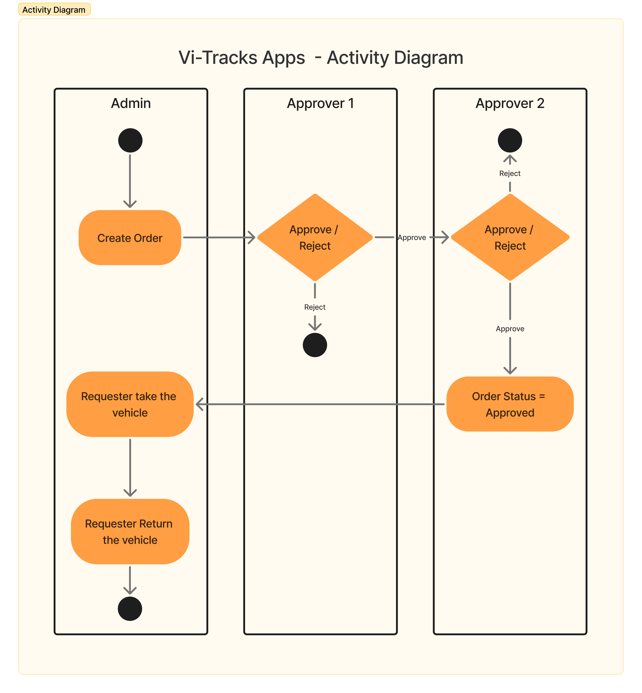
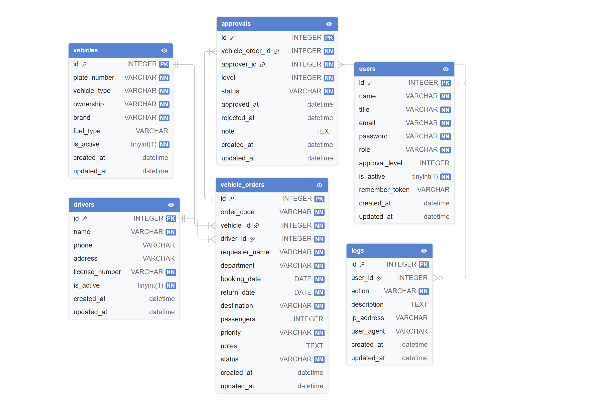

# 🚗 Vi-Tracks (Vehicles Tracking App)

Aplikasi web untuk **pemesanan dan monitoring kendaraan operasional** perusahaan tambang nikel dengan sistem persetujuan berjenjang.

---

## 📌 Deskripsi Aplikasi

Vi-Tracks adalah aplikasi berbasis web yang digunakan untuk:

- Mengelola pemesanan kendaraan operasional
- Mengatur driver dan kendaraan
- Melakukan persetujuan pemesanan secara berjenjang
- Monitoring status pemesanan melalui dashboard
- Menyediakan laporan pemesanan yang dapat diekspor dalam bentuk excel

Aplikasi ini dibuat sebagai bagian dari **Technical Test Fullstack Developer (Intern) Sekawan Media**.

---

## 👥 Jenis User

### 1️⃣ Admin

- Membuat pemesanan kendaraan
- Menentukan kendaraan, driver, dan pemesan
- Menentukan approver level 1 dan level 2
- Melihat seluruh data pemesanan
- Melihat dashboard
- Melihat log aktifitas
- Mengekspor laporan data pemesanan

### 2️⃣ Approver (Penyetuju)

- Melakukan persetujuan pemesanan kendaraan
- Persetujuan dilakukan **minimal 2 level**
- Melihat daftar pemesanan yang menunggu persetujuan

---

## 🔄 Alur Persetujuan

1. Admin membuat pemesanan kendaraan
2. Approver Level 1 melakukan peninjauan awal dan menyetujuinya
3. Approver Level 2 melakukan persetujuan akhir
4. Status pemesanan dapat berubah menjadi:
    - `PENDING`
    - `IN PROGRESS`
    - `REJECTED`
    - `APPROVED`
    - `IN USE`
    - `COMPLETED`

---

## 🧱 Teknologi yang Digunakan

| Teknologi | Versi                |
| --------- | -------------------- |
| Laravel   | 12                   |
| PHP       | 8.4                  |
| Database  | SQlite               |
| Frontend  | Blade + Tailwind CSS |
| Chart     | SVG / Chart.js       |

---

## 🗄️ Struktur Database (Ringkas)

### users

- id
- name
- email
- password
- role (admin / approver)
- created_at

### vehicles

- id
- brand
- plate_number
- vehicle_type (angkutan_orang / angkutan_barang)
- ownership (company / rental)
- status
- created_at

### drivers

- id
- name
- address
- phone
- created_at

### vehicle_orders

- id
- order_code
- vehicle_id
- driver_id
- requester_name
- booking_date
- return_date
- status
- notes
- created_at

### approvals

- id
- vehicle_order_id
- approver_id
- level
- status
- note
- approved_at
- created_at

### logs

- id
- user_id
- action
- description
- created_at

---

## 📊 Dashboard

Dashboard menampilkan:

- Total pemesanan kendaraan
- Jumlah pemesanan hari ini
- Pemesanan pending
- Pemesanan selesai
- Grafik kendaraan paling sering dipesan
- Distribusi status pemesanan
- Daftar pemesanan terbaru

---

## 📈 Grafik yang Digunakan

- **Bar Chart**: Kendaraan paling sering dipesan
- **Donut Chart (SVG)**: Distribusi status pemesanan
    - Approved
    - Completed
    - Pending
    - Rejected
    - In Progress
    - In Use

---

## 📤 Export Laporan

- Laporan pemesanan kendaraan dapat diekspor ke format **Excel**
- Dapat difilter berdasarkan tanggal

---

## 🔐 Akun Dummy (Seeder)

| Role             | Email                 | Password |
| ---------------- | --------------------- | -------- |
| Admin            | admin@vitracks.com    | 12345678 |
| Approver Level 1 | manager@vitracks.com  | 12345678 |
| Approver Level 2 | director@vitracks.com | 12345678 |

---

## ▶️ Cara Menjalankan Aplikasi

```bash
git clone <repository-url>
cd vi-tracks
composer install
cp .env.example .env
php artisan key:generate
php artisan migrate --seed
npm run build
php artisan serve
```

Akses aplikasi di:

```bash
http://127.0.0.1:8000
```

## 📝 Catatan Tambahan

- Implementasi saat ini berfokus pada core flow aplikasi (order, approval, dan reporting).
- Beberapa fitur non-kritis belum diimplementasikan secara penuh akibat keterbatasan waktu pada fase pengembangan awal.
- Desain sistem dibuat modular dan scalable untuk memudahkan penambahan fitur di iterasi berikutnya.

## Activity Diagram Preview



## PDM (Physical Data Model)



## 👨‍💻 Author

Dibuat oleh Naufal Harits Prasetia
Sebagai bagian dari Technical Test Fullstack Developer (Intern) Sekawan Media
